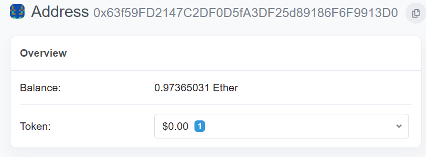
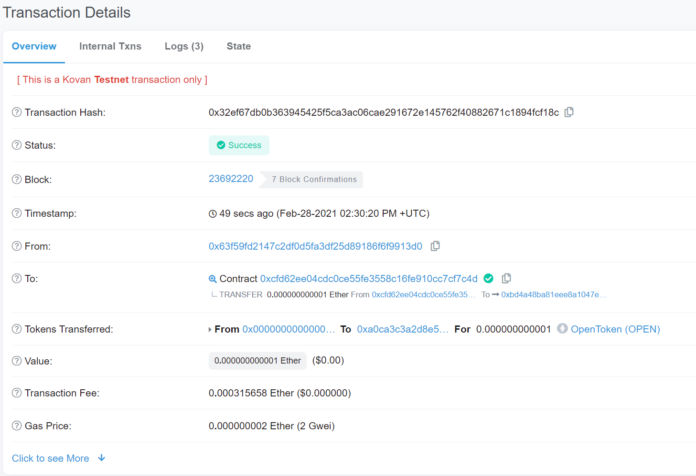

# Solidity_Hmwk_2
This homework demonstrates more advanced solidity functionality through the creation of a token with a crowdsale that has both a time limit and maximum amount.

### Code Files
It is important to note that the close time specified currently is set at now + 5 minutes for testing purposes. Change this to whatever suits your needs BEFORE compiling.

The steps for deploying the code files are as follows:

1. Deploy the PupperCoinSaleDeployer contract using the deployment section of solidity. There is a field box that allows for changing the contracts so make sure that is set to the right contract. Fill in the fields required for token name, token, wallet address, goal, and cap. Note the goal and cap are in wei.

2. Once that has successfully deployed use the token_sale_address function to populate the At Address field in the deployer section. Switch the contract to PupperCoinSale and deploy.

3. Lastly, switch to the final contract of PupperCoin and use the token_address function generated by the first deployment to populate the address field. Deploy this final contract.

Once you have successfully deployed all the contracts there is the ability to test many of the built-in functions such as seeing the coin name, goal, cap, etc. that you specified in the first contract deployment.

### Review of Main Functions
buyTokens - Allows the purchase of tokens below the cap specified. The amount can be changed to Ether or Wei based on what is specified next to the value field in solidity; however, at the time contract deployment the goal and cap amount are determined in wei.

finalize - Once both the goal and close time have been achieved the token sale can be finalized.

withdrawTokens - Once the sale is finalized the accounts which purchased tokens can withdraw them.

claimRefund - Used for refunding if the sale goal is not achieved.

### Images
The following sets of images will show the successful deployment and testing of the smart contract.

First the initial wallet values in ganache.

The first token deployed.

Purchasing the goal amount of Ether in tokens.

A few checks that the purchase worked correctly.

After finalizing the crowdsale this value should return when clicking finalize.

Adding the token to MetaMask is easy. Simply click the add token button and enter the token_address from the first deployment.

Lastly this can be deployed on a real testnet in the real world!! 

See the below set of images for a separate crowdsale of a different coin using the Kovan test network.

